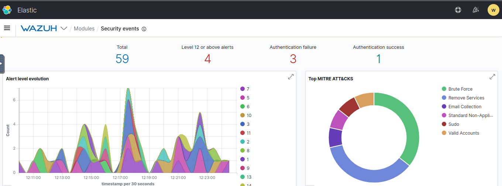
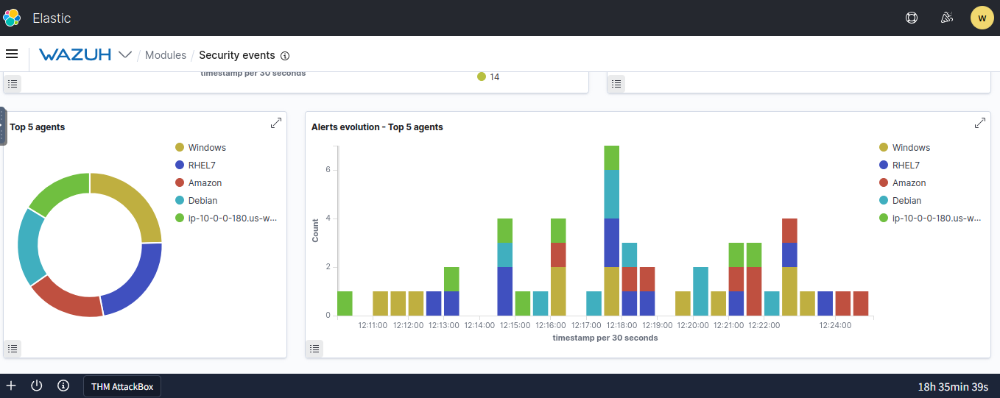
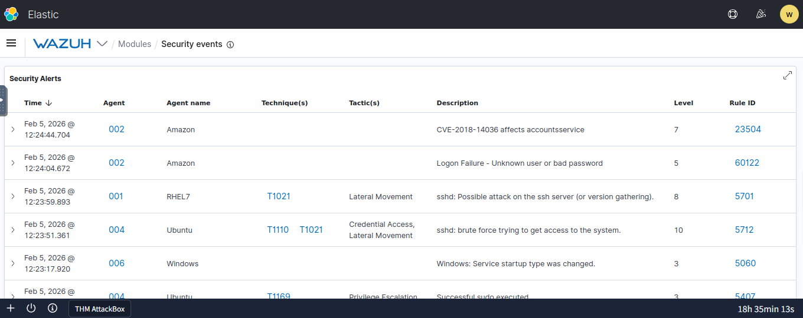
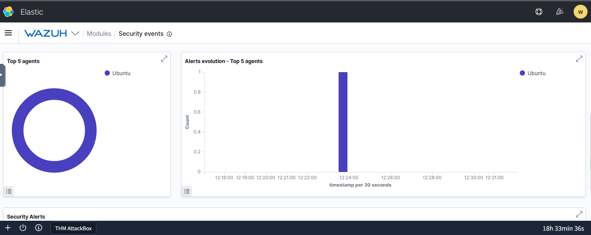
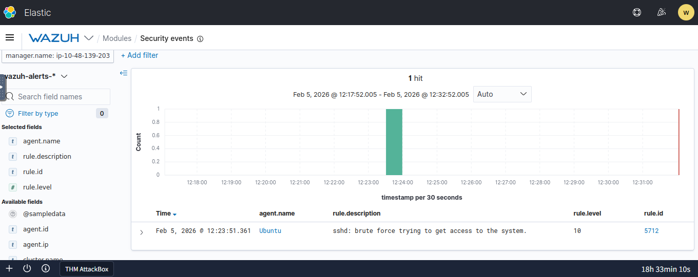
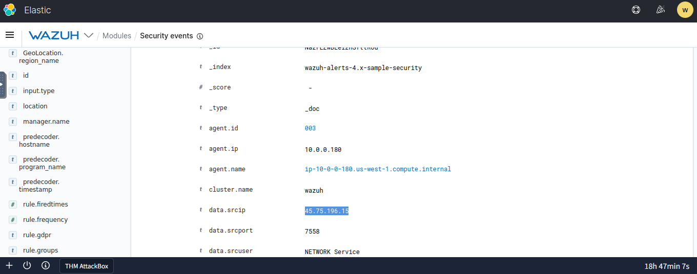

# SOC Incident Report: Brute Force Analysis
**Analyst:** [Your Name] | **Status:** RESOLVED

## Brute Force Attack Evidence (8 Stages)
*Click a screenshot to analyze the evidence. The background will blur, and a detailed summary will appear below the image.*

  
  
  
  
  
  
  
  

  &times;
  <a class="prev" onclick="changeSlide(-1)">&#10094;</a>
  <a class="next" onclick="changeSlide(1)">&#10095;</a>
  
  
  
  

    

    

  

