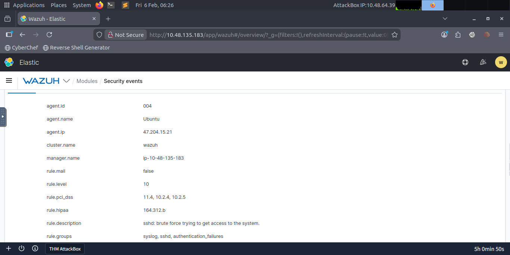
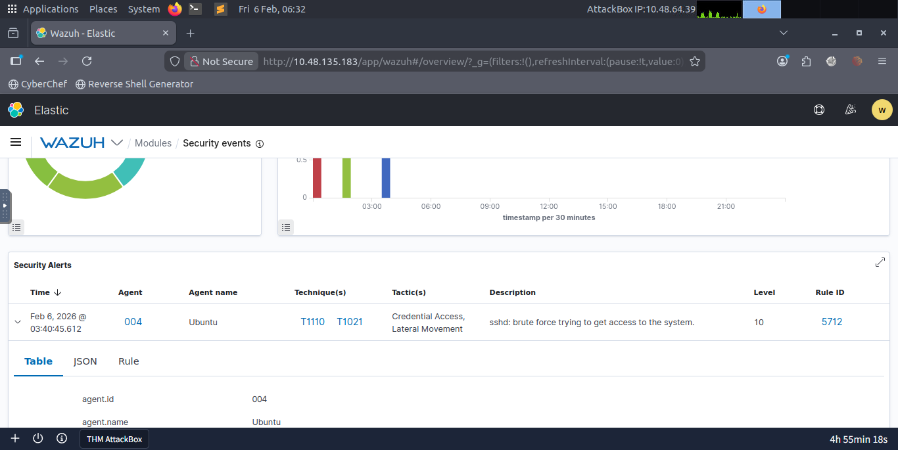
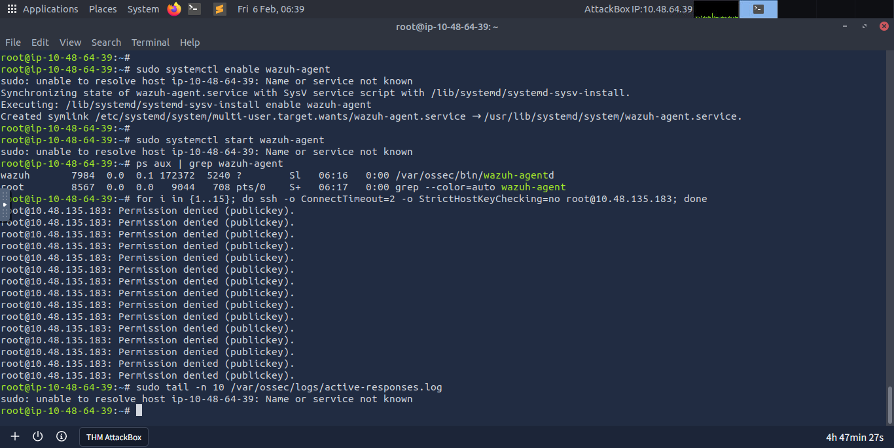

    <h1 style="margin:0; color:#007bff;">Incident Report: SSH Brute Force Analysis</h1>
    
<strong>Analyst:</strong> [Your Name] | <strong>Status:</strong> RESOLVED

    
<strong>Summary:</strong> Identified and mitigated a persistent brute force attack originating from IP 141.98.81.37 targeting administrative credentials. Recovery included manual restoration of corrupted Agent 004 configurations following a system crash.

<h3 style="color:#eee;">Evidence Gallery (14 Stages)</h3>

    
    
    
    
    
    
    
    
    
    
    
    
    

    &times;
    
  <a class="prev" onclick="changeSlide(-1)">&#10094;</a>
    <a class="next" onclick="changeSlide(1)">&#10095;</a>

  

        
        

            <h2 id="detailTitle" style="color:#007bff; margin-top:0;"></h2>
            

        

    

