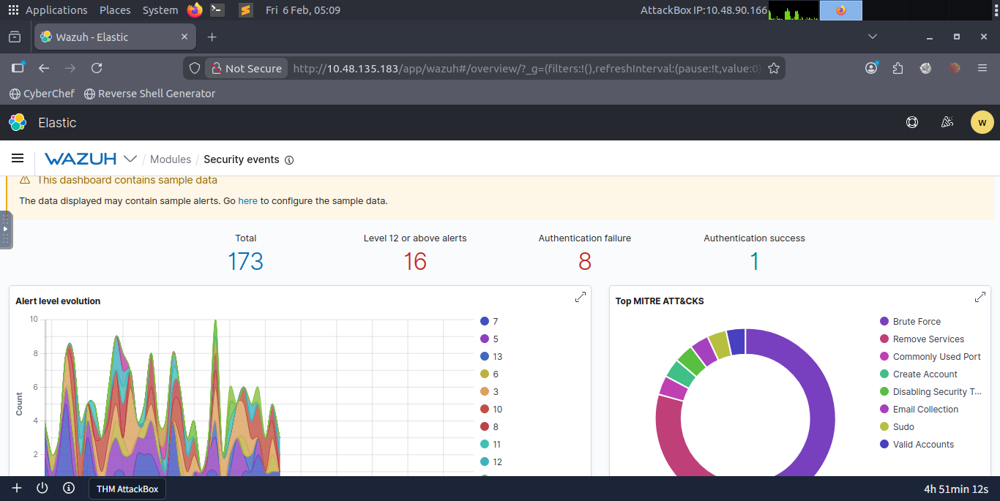
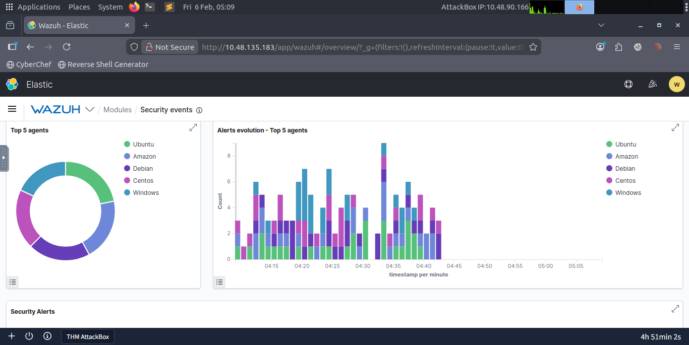
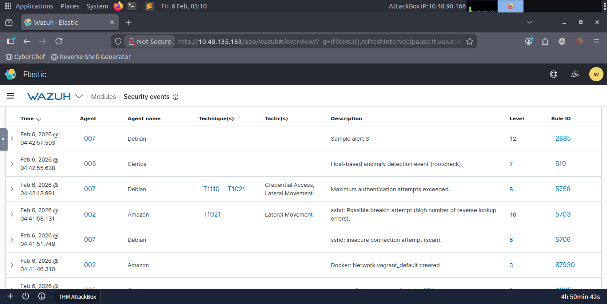
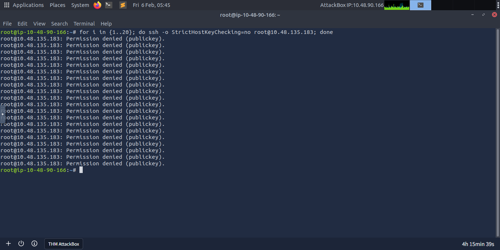
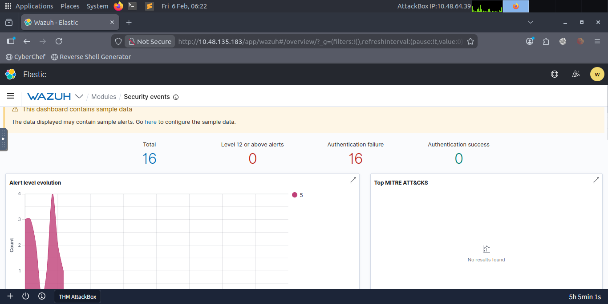
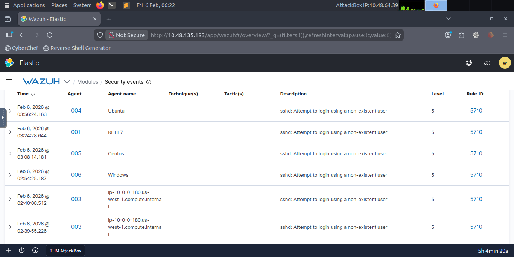
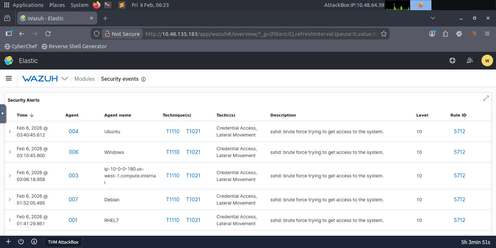
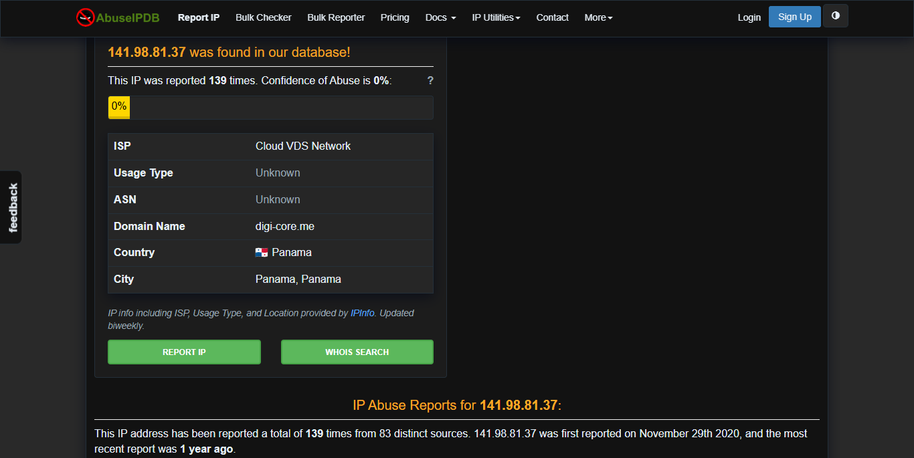
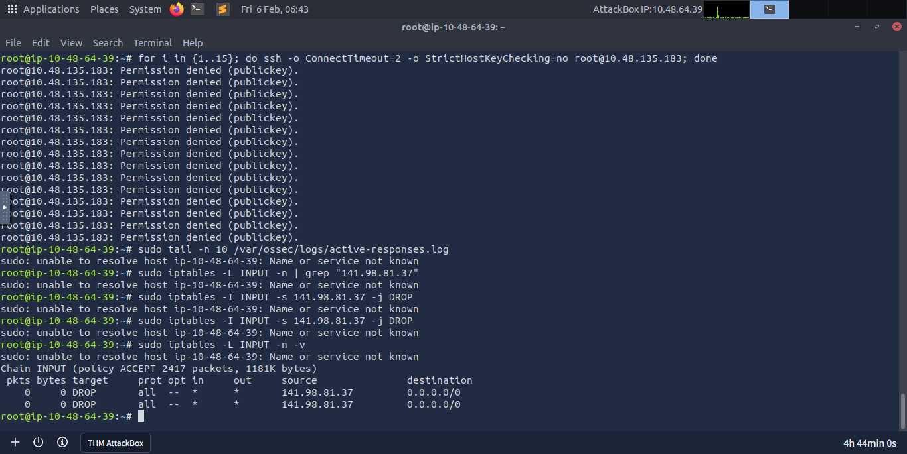

    <aside class="profile-sidebar">
        
        <h2>Arivazhagan</h2>
        
SOC Analyst L1

        
Specializing in SIEM monitoring, incident response, and threat hunting. Passionate about securing cloud environments and defending against credential-based attacks.

        

            
<strong>Certifications:</strong> Security+, BTL1 (In Progress)

            
<strong>Tools:</strong> Wazuh, Splunk, Wireshark, Nmap

        

    </aside>

    <main class="report-content">
        <h1 style="color: #ffffff; margin-bottom: 10px; text-shadow: 2px 2px 4px rgba(0,0,0,0.5);">Incident Report: SSH Brute Force Analysis</h1>
        
<strong>Status:</strong> ● Resolved

        

            <h3 style="margin-top: 0; color: #38bdf8;">/// Quick Summary & Verdict</h3>
            
<strong>Verdict:</strong> Confirmed Malicious Brute Force Attack via automated script.

            
<strong>Action Taken:</strong> After identifying a persistent credential harvesting attempt from IP 141.98.81.37, I bypassed a system-level configuration crash to implement a host-based firewall block (IPTables), successfully terminating the threat actor's access.

        

        <h3 style="color: #94a3b8; font-size: 1em; letter-spacing: 1px;">EVIDENCE GALLERY (Click to Investigate)</h3>
        

            
            
            
            
            
            
            
            
            
            
            
            
            
            
        

    </main>

    &times;
    <a class="nav-btn prev" onclick="changeSlide(-1)">&#10094;</a>
    <a class="nav-btn next" onclick="changeSlide(1)">&#10095;</a>

    

        
        

            <h2 id="detailTitle" style="color: #38bdf8; margin-top: 0;"></h2>
            

            

                <strong style="color: #38bdf8;">L2 Escalation Logic:</strong>
                

            

        

    

