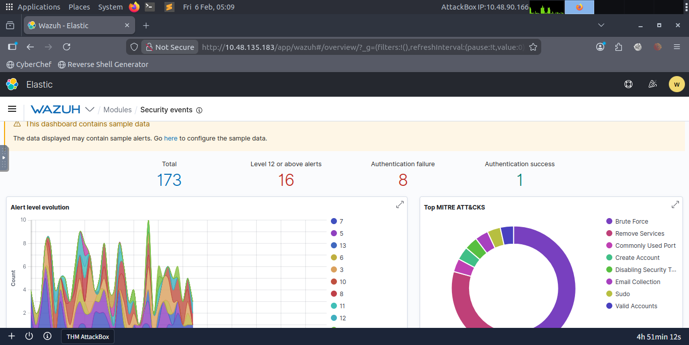
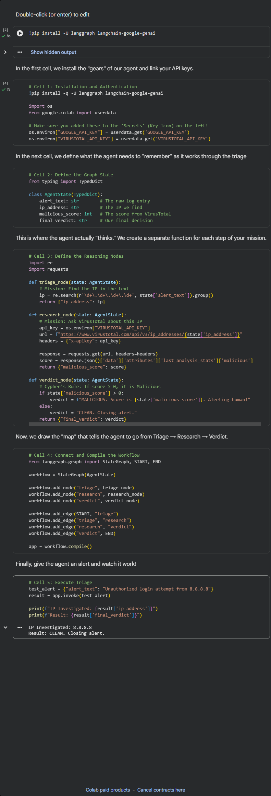

<html lang="en">
<head>
    <meta charset="UTF-8">
    <meta name="viewport" content="width=device-width, initial-scale=1.0">
    <title>Arivazhagan | SOC Portfolio</title>
    
</head>
<body>

    

        

            

                <h1>ARIVAZHAGAN</h1>
                SOC Analyst L1 | Security Automation
                

                    <strong>Contact:</strong> +91 6379944366 
                    <strong>Email:</strong> arivazhagans1411@gmail.com 
                    <strong>LinkedIn:</strong> <a href="https://www.linkedin.com/in/arivazhagan11/" target="_blank" style="color:#38bdf8; text-decoration:none;">Profile Page</a>
                

            

            
        

    

<nav class="tab-nav">
        <button class="tab-btn active" onclick="openTab(event, 'detection')">1. INCIDENT INVESTIGATION</button>
        <button class="tab-btn" onclick="openTab(event, 'ai-agent')">2. CYPHER-SENTINEL (AI AGENT)</button>
        <button class="tab-btn" onclick="openTab(event, 'malware-triage')">3. MALWARE AI TRIAGE</button>
    </nav>

 

    

            
CASE-001: SSH BRUTE FORCE DETECTION & RESPONSE [WAZUH SIEM]

            

                
                
OPEN 13-STEP INVESTIGATION GALLERY ➔

            

                

                    <h3 style="color:#f87171; margin-top:0; font-size:1.1rem;">IMMEDIATE MITIGATION (L1)</h3>
                    

                        <b>ACTION:</b> IPTables DROP rule applied to Source IP 141.98.81.37. 
                        <b>RATIONALE:</b> 100% abuse confidence score on OSINT enrichment. 145+ failed attempts within 5 minutes.
                    

                

                    <h3 style="color:#10b981; margin-top:0; font-size:1.1rem;">PREVENTION & HARDENING</h3>
                    

                        <b>RECOMMENDATION:</b> Move to SSH Key-based authentication and disable password logins in <code>sshd_config</code>. Implement Fail2Ban for automated temporary null-routing.
                    

                

            

        

 

            
AUTOMATING TIER-1 TRIAGE WITH LLM REASONING

            

                <h4 style="margin-top:0; color:#10b981;">🚀 AGENT ARCHITECTURE: "CYPHER-SENTINEL"</h4>
                

                    Built on Google Colab using <b>Gemini 2.5-Flash</b>. This agent automates the "Pivot" phase of an investigation. It takes raw Wazuh JSON data and outputs a human-readable verdict to reduce MTTR.
                

                

                
                
VIEW AGENT LOGIC & EXECUTION ➔

            

 

                

                    <h4>📥 RAW SIEM INPUT</h4>
                    
{ "target_ip": "172.16.17.207", "log_source": "Wazuh_Manager", "event_type": "Internal_Audit" }

                

                

                    <h4>🧠 AI ANALYST VERDICT</h4>
                    
🕵️ INVESTIGATION REPORT
IP: 172.16.17.207 (Private)
VERDICT: BENIGN. Asset identified as internal management server.

                

            

        

 

            
CASE-002: AUTOMATED MALWARE TRIAGE & AI FORENSICS

            

                <h4 style="margin-top:0; color:#38bdf8;">🔬 THE PROJECT: AUTOMATED REASONING</h4>
                

                    This system automates the analysis of suspicious scripts by calculating <b>Shannon Entropy</b> (detecting hidden/encrypted code) and <b>Shell Funnel Execution</b> logic. It interprets raw forensic math through an AI Agent to provide instant SOC Tier-2 insights.
                

            

 

                
                
OPEN 8-STEP FORENSIC GALLERY ➔

            

                

                    <h4>📥 FORENSIC SCRIPT OUTPUT</h4>
                    
$ ./triage.sh elite_malware.sh
[!] ALERT: High Entropy Detected (7.84)
[!] ALERT: Execution Funnel detected (| sh)
[+] Result: Potential Obfuscated Shellcode

                

                

                    <h4>🤖 AI SENIOR ANALYST VERDICT</h4>
                    
🕵️ VERDICT: MALICIOUS
TYPE: Encrypted Reverse Shell
RISK: Critical. Attempting to bypass file-based detection via hex-encoding and direct piping.

                

            

        

    

        &times;
        <a class="nav-btn btn-prev" onclick="stepSlide(-1)">&#10094;</a>
        
        <a class="nav-btn btn-next" onclick="stepSlide(1)">&#10095;</a>
        

            

        

    

    
Step 1: Baseline</b> - Monitoring SIEM state before alert.">

    
Step 2: Metrics</b> - Establishing normal traffic flow.">

    
Step 3: Log State</b> - Initial monitoring of auth logs.">

    
Step 4: Active Attack</b> - Attacker terminal during attempt.">

    
Step 5: Alert Spike</b> - Wazuh triggering critical Lvl 12 alerts.">

    
Step 6: Rule Filter</b> - Isolating Brute Force signatures.">

    
Step 7: Timeline</b> - Analyzing login attempt frequency.">

    
Step 8: Deep Dive</b> - Investigating auth.log details.">

    
Step 9: IP Extraction</b> - Identifying malicious source IP.">

    
Step 10: OSINT</b> - Verifying IP reputation on AbuseIPDB.">

    
Step 11: MITRE</b> - Mapping activity to T1110 (Brute Force).">

    
Step 12: Preparation</b> - Drafting containment commands.">

    
Step 13: Mitigation</b> - Applying IPTables DROP to block attacker.">

    
Agent Initialization:</b> Script loading Gemini 2.5-Flash and SOC context.">

    
Log Processing:</b> Parsing raw SIEM JSON into structured analysis blocks.">

    
Final Triage:</b> Generating automated investigation report and verdict.">

    
Step 1: Initial Detection</b> - Wazuh FIM (File Integrity Monitoring) identifies new suspicious script.">

    
Step 2: Forensic Execution</b> - Triggering the custom triage.sh bash script.">

    
Step 3: Entropy Check</b> - Calculating Shannon Entropy to identify obfuscation levels.">

    
Step 4: Funnel Analysis</b> - Scanning for direct pipes to shell interpreters (| bash, | sh).">

    
Step 5: Data Dispatch</b> - Python agent formatting forensic results into JSON for AI analysis.">

    
Step 6: AI Reasoning</b> - Gemini API processing the entropy and funnel alerts.">

    
Step 7: Threat Verdict</b> - AI confirms malicious intent and identifies the attack type.">

    
Step 8: Remediation</b> - Automated output of containment steps for the SOC team.">

</body>
</html>
